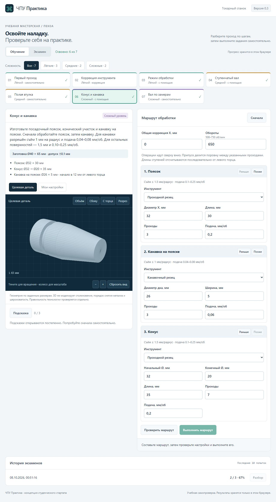

# ЧПУ Практика

Учебный тренажёр наладки токарного станка с ЧПУ: обучение, планирование обработки и самопроверка. Версия 0.3 концепции студенческого стартапа для подготовки технических кадров Пензенской области.



## Что работает

- Семь упражнений: три лёгких, два средних и два сложных; фильтр по уровню.
- Выбор инструмента и настройка X, коррекции X, подачи и оборотов.
- Проверка ошибок, последовательные подсказки и отметки о прохождении упражнений.
- Проход по четырём этапам: подход, установка X, обработка и отвод; пауза и переход к следующему шагу.
- Иллюстрация G-кода с подсветкой текущего этапа.
- Экзамен из трёх заданий с другими размерами детали, без подсказок и пробного запуска. Три варианта размеров чередуются между попытками.
- Один ответ на задание, итоговый балл, разбор ошибок и возврат к нужной теме.
- История последних десяти экзаменов, скачивание текстового отчёта и восстановление незаконченного экзамена.
- Интерфейс для компьютера и телефона.
- 3D-осмотр всех деталей: вращение мышью, касанием или стрелками; масштаб колесом, кнопками или клавишами +/−; виды сбоку, с торца, объёмный вид и продольный разрез.
- Сравнение целевой геометрии и размеров по своим настройкам, включая отверстие, ступени, конус и канавку.

**Нейросеть пока не подключена.** Наставник использует локальные правила и распознавание тем вопроса. API-ключи и внешние сервисы для запуска не нужны.

## Быстрый запуск

Откройте `index.html` в браузере. Все необходимые файлы находятся рядом.

Для передачи одним файлом используйте `demo/cnc-demo.html`: он содержит встроенные стили и скрипты и работает без интернета.

После правки исходников пересоберите его командой `npm run build:demo`.

Если установлен Node.js, можно запустить локальный сервер:

```sh
npm start
```

Откройте адрес `http://127.0.0.1:4173`. Устанавливать зависимости не требуется.

## Первое упражнение

1. Выберите «Первый проход».
2. Нажмите «Проверить настройки»: при исходном X = 30 мм останется припуск.
3. Установите X = 28 мм, коррекцию X = 0 мм, подачу 0,20 мм/об, обороты 800 об/мин и проходной резец.
4. Запустите «Пробный проход». После завершения упражнение будет отмечено выполненным.

Для самостоятельного прохождения настройте параметры без проверки и подсказок. Кнопка «Следующий шаг» разбирает тот же проход по этапам; во время движения настройки заблокированы. Проверка и помощь наставника отмечают текущую попытку как выполненную с помощью.

## Экзамен и сохранение

Базовый экзамен проверяет три лёгкие темы. Откройте вкладку «Экзамен» и нажмите «Начать экзамен». Для каждого задания настройте параметры и нажмите «Сдать ответ». После сдачи изменить ответ нельзя; оценка и объяснения появятся после третьего задания. Каждый верный ответ даёт треть итогового результата (0, 33, 67 или 100%). Новые задания средней и высокой сложности доступны в обучении с отдельной проверкой маршрута.

Прогресс и история хранятся в `localStorage` этого браузера; между устройствами не синхронизируются. Настройки незаконченного экзамена сохраняются при перезагрузке и переключении в обучение. При недоступном хранилище интерфейс предупреждает об этом. В режиме открытия файла сохранение зависит от настроек браузера.

Это самопроверка: серверной аттестации, учётных записей и защиты от изменения локальных данных нет.

## Новые детали и сложность

| Уровень | Деталь | Что требуется |
| --- | --- | --- |
| Средний | Ступенчатый вал Ø32 / Ø24, длина 60 мм | Рассчитать число проходов для каждой ступени из Ø40 с ограничением 2 мм на радиус |
| Средний | Втулка Ø30, отверстие Ø22, длина 45 мм | Выбрать расточной резец, обработать отверстие перед наружной поверхностью, выдержать стенку 4 мм |
| Сложный | Поясок Ø32, конус Ø32 → Ø20 и канавка Ø26 | Согласовать инструменты, режимы, проходы и порядок обработки пояска и канавки |
| Сложный | Вал Ø36 / Ø30 / Ø24 | Определить постоянное смещение +0,4 мм по трём замерам и компенсировать его общей коррекцией |

Карточки операций перемещаются кнопками «Раньше» и «Позже». Порядок карточек задаёт технологическую последовательность; расположение поверхностей определяется заданием. Припуск условно распределён поровну между проходами. «Проверить маршрут» проверяет размеры, инструменты, режимы, глубину прохода, порядок и диагноз. Затем «Выполнить маршрут» засчитывает расчётно проверенный план. Анимации движения инструмента для этих четырёх задач пока нет.

Ошибочная проверка или открытая подсказка отмечает новую задачу как пройденную с помощью. Маршруты и подсказки хранятся локально под ключом `cnc-lab-v1`, общий прогресс — `cnc-practice-v2`. Прогресс версии 0.2 сохраняется.

3D-просмотр работает без внешних библиотек и сети: поверхности вращения строятся из размерного профиля и проецируются на canvas. Разрез открывает внутреннюю поверхность втулки; Home сбрасывает ракурс. Это геометрическая иллюстрация заданных размеров, а не проверка столкновений или последовательного снятия материала. Недопустимые геометрии ограничиваются для отображения и отклоняются проверкой маршрута.

## Упрощения модели

- В обучении заготовка Ø32 мм, цель Ø28 ±0,1 мм, длина 45 мм. В экзамене размеры указаны в каждом задании.
- X и коррекция в демке задаются по диаметру: диаметр траектории = X + коррекция X.
- Учебные условия: подача 0,10–0,25 мм/об, обороты 600–1000 об/мин, съём до 2 мм на радиус за проход, правильная коррекция X = 0 мм.
- Анимация ускорена. Силы резания, шероховатость, деформация и полный цикл станка не моделируются.
- Показанный G-код служит иллюстрацией; интерпретатора произвольного G-кода нет.
- Учебные режимы и код не предназначены для применения на реальном оборудовании.

## Файлы

| Файл | Назначение |
| --- | --- |
| `index.html` | Разметка интерфейса и схема станка |
| `style.css` | Стили и адаптация к размеру экрана |
| `model.js` | Упражнения, расчёты, проверка и ответы наставника |
| `lab-model.js` | Четыре новые детали, проверка маршрутов и размерные профили |
| `lab-ui.js` | Карточки операций, подсказки и сохранение маршрутов |
| `viewer3d.js` | Трёхмерные поверхности вращения и управление камерой |
| `app.js` | Управление интерфейсом и анимацией |
| `scripts/serve.cjs` | Локальный сервер без зависимостей |
| `scripts/build-demo.cjs` | Сборка автономной HTML-версии |
| `tests/model.test.cjs` | Проверки учебной модели |
| `tests/exam.test.cjs` | Проверки экзамена, восстановления и этапов |
| `tests/lab.test.cjs` | Проверки новых деталей, проходов, инструментов, порядка и диагностики |
| `demo/cnc-demo.html` | Автономная версия в одном файле |

В браузерах с поддержкой WebMCP доступны чтение состояния и проверка выбранного учебного задания. Настройка через инструмент поддерживает три базовые темы; новые маршруты редактируются карточками. Во время экзамена настройка и проверка через инструменты недоступны, чтение состояния не раскрывает оценку.

## Проверки

```sh
npm test
```

Проверяются правильный проход, исходные ошибки, чрезмерный съём, отсутствие резания вне заготовки, пересечение оси, инструмент, числовые ограничения и ответы наставника. Для экзамена проверяются все варианты, оценка, запрет повторной сдачи и неверного перехода, восстановление состояния и отклонение повреждённых данных.

## Дальнейшее развитие

Подключение нейросетевого наставника через сервер, объяснения по проверенным учебным материалам, дополнительные детали и упражнения, отчёты преподавателя и пилот с учебным заведением. Секретные ключи модели должны храниться на сервере.
